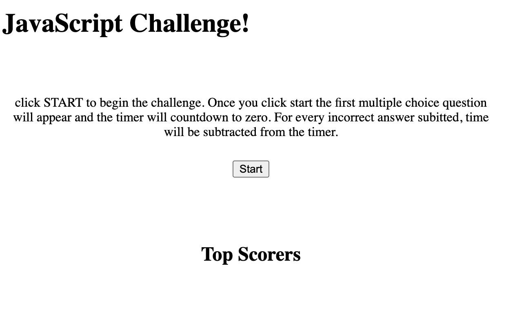
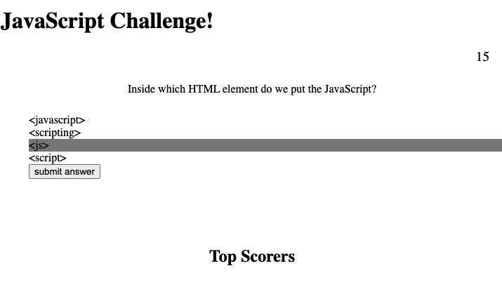

# coding_quiz_challenge

## Description
The goal of this project is to build a coding quiz challenge. The user will be presented with a start button and upon starting, a series of JavaScript related questions will appear one after the other. When the user answers incorretly time is subtracted from the clock and when all questions are answered or the timer runs out the game is over. The user will be asked to provide their information in order to save their score which will then be saved to a database containing all scores from previous players. This page should be web responsive on all devices. 

link to github repo:
https://github.com/jcorcorangithub/coding_quiz_challenge

link to application:
https://jcorcorangithub.github.io/coding_quiz_challenge/

## Technologies
HTML, CSS, JavaScript

## License
MIT

## Contact
Name: James Corcoran
email: jpcsoccer1234@gmail.com